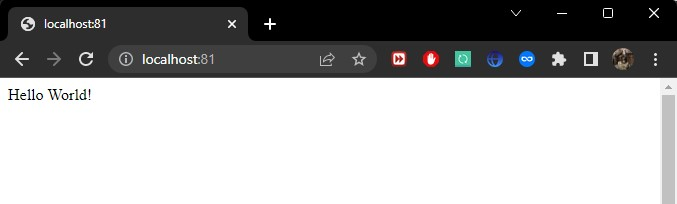
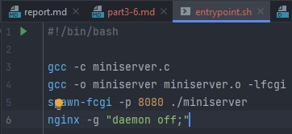

## Part 3. Мини веб-сервер  
* Пишем мини сервер на C и FastCgi, который будет возвращать простейшую страничку с надписью `Hello World!`  
  

* Пишем свой nginx.conf, который будет проксировать все запросы с 81 порта на 127.0.0.1:8080  
  

* Качаем образ nginx, запускаем контейнер, копируем c файл сервера и conf файл nginx  
  

* Заходим в контейнер командой `docker exec -it intelligent_meninsky bash`, обновляем репозитории, устанавливаем gcc, spawn-fcgi и libfcgi-dev  
  

* Компилируем и запускаем сервер  
  

* проверяем нашу страничку  
  

## Part 4. Свой докер  
* Создаём докерфайл  
  

* Создаём скрипт, выполняющий роль entrypoint  
  

* Собираем образ через `docker build` при этом указав имя и тег  
  

* проверяем через `docker images`, что все собралось корректно  
  

* прежде чем запускать вытащим из образа папку nginx для последующего маппинга  
  
  

* Запускаем собранный докер образ с маппингом 81 порта на 80 на локальной машине и маппингом папки ./nginx внутрь контейнера по адресу, где лежат конфигурационные файлы nginx'а  
  

* проверяем в браузере  
  

* Дописываем в ./nginx/nginx.conf проксирование странички /status, по которой надо отдавать статус сервера nginx  
  

* Перезапускаем докер образ, проверяем, заглядываем в браузер  
  
  
  

## Part 5. Dockle  
* сперва установим доклю  
  

* потом проверим образ  
  

* Понимаем, что с ошибкой CIS-DI-0010 никак не разобраться, даже сменой версии nginx, и пересаживаемся на ubuntu/nginx  
* переписываем докерфайл  
  

* переписываем nginx.config, потому что он теперь новый  
  

* билдим, проверяем и радуемся, что обошлись без заглушек  
  

## Part 6. Базовый Docker Compose  
* Перепишем скрипт entrypoint для второго контейнера, иначе он будет завершать работу после `docker-compose up`  
  

* Перепишем _**nginx.conf**_ для проксирования  
  

* добавим пользователя в группу root  
  

* напишем **_docker-compose.yml_**  
  

* билдим командой `sudo docker-compose build` и запускаем командой `sudo docker-compose up` наш docker-compose  
  

* проверяем работу  
  

* и, на всякий случай, в браузере  
  
  
