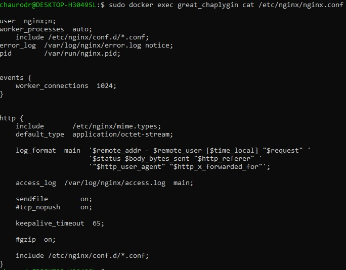
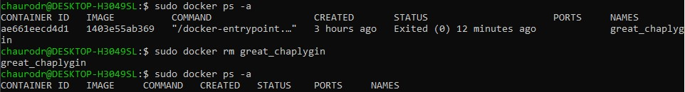

## Part 1. Готовый докер  
#### 1) Взять официальный докер образ с nginx и выкачать его при помощи docker pull  
* используем команду `sudo docker pull nginx`  
  

#### 2) Проверить наличие докер образа через docker images  
* используем команду `sudo docker images`  
  

#### 3-4) Запустить докер образ через `docker run -d [image_id|repository]` и проверить что образ запустился через `docker ps`  
* используем команду `sudo docker run -d nginx` и проверяем, что образ запустился с помощью команды `sudo docker ps`  
  

#### 5) Посмотреть информацию о контейнере через `docker inspect [container_id|container_name]`  
* используем команду `sudo docker inspect recursing_almeida`  
  

#### 6) По выводу команды определить и поместить в отчёт размер контейнера, список замапленных портов и ip контейнера  
* найдём размер контейнера командой `sudo docker inspect recursing_almeida --size | grep -i SizeRw`  
  

* найдём в выводе команды `sudo docker inspect recursing_almeida` список портов  
  

* найдём ip контейнера командой `sudo docker inspect recursing_almeida --size | grep -i ip`  
  
Отдельно замечу, что флаг `--size` здесь необязателен. У меня он остался из-за вызова предыдущей команды.  

#### 7-8) Остановить докер образ через `docker stop [container_id|container_name]` и проверить, что образ остановился через `docker ps`  
* используем команду `sudo docker stop recursing_almeida` и проверяем остановку командой `sudo docker ps`  
  

#### 9) Запустить докер с замапленными портами 80 и 443 на локальную машину через команду `run`  
* используем команду `sudo docker run -d -p 8-:80 -p 443:443 nginx` и сразу проверим запуск и порты командой `sudo docker ps`  
  

#### 10) Проверить, что в браузере по адресу localhost:80 доступна стартовая страница nginx  
* Открываем любой браузер и в адресной строке пишем localhost:80  
  

#### 11-12) Перезапустить докер контейнер через `docker restart [container_id|container_name]` и проверить любым способом, что контейнер запустился  
* перезапускаем контейнер командой `sudo docker restart great_chaplygin` и проверяем запуск командой `sudo docker ps`  
  

## Part 2. Операции с контейнером  
#### 1) Прочитать конфигурационный файл nginx.conf внутри докер контейнера через команду `exec`  
* используем команду `sudo docker exec great_chaplygin cat /etc/nginx/nginx.conf`  
  

#### 2) Создать на локальной машине файл nginx.conf  
* создаём файл  
  

#### 3) Настроить в нем по пути /status отдачу страницы статуса сервера nginx  
* дописываем блок http  
  
также потребовалось закомментировать `include /etc/nginx/conf.d/*.conf`, потому что с этой строкой не отображалась страница status.  

#### 4-5) Скопировать созданный файл nginx.conf внутрь докер образа через команду `docker cp` и Перезапустить nginx внутри докер образа через команду `exec`  
* копируем файл командой `sudo docker cp nginx.conf great_chaplygin:etc/nginx/` и перезапускаем nginx командой `sudo docker exec great_chaplygin nginx -s reload`  
  

#### 6) Проверить, что по адресу localhost:80/status отдается страничка со статусом сервера nginx  
* открываем браузер и проверяем  
  

#### 7) Экспортировать контейнер в файл container.tar через команду export  
* экспортируем контейнер командой `sudo docker export -o cnt.tar great_chaplygin  `
  

#### 8) Остановить контейнер  
* останавливаем контейнер командой `sudo docker stop great_chaplygin`  
  

#### 9) Удалить образ через `docker rmi [image_id|repository]`, не удаляя перед этим контейнеры  
* удаляем образ командой `sudo docker rmi -f nginx`  
  

#### 10) Удалить остановленный контейнер  
* удаляем контейнер командой `sudo docker rm great_chaplygin`  
  

#### 11) Импортировать контейнер обратно через команду import  
* используем команду `sudo docker import -c 'CMD ["nginx", "-g", "daemon off;"]' cnt.tar test`  
  

#### 12) Запустить импортированный контейнер  
* запускаем контейнер командой `sudo docker run -d -p 80:80 -p 443:443 test`  
  

#### 13) Проверить, что по адресу localhost:80/status отдается страничка со статусом сервера nginx  
* открываем браузер и смотрим  
